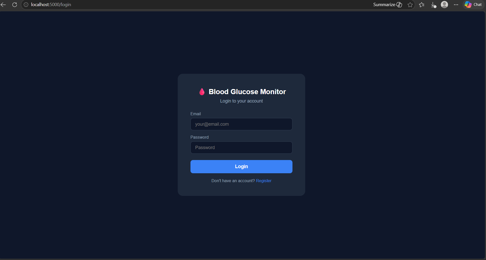
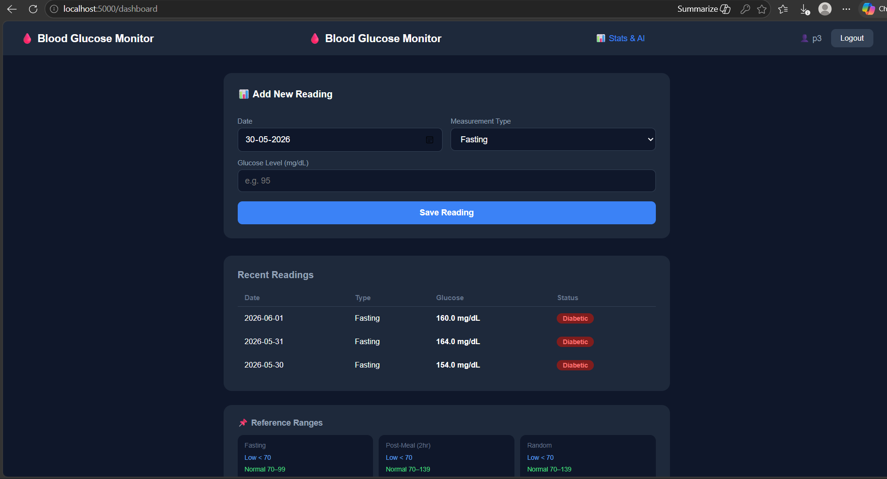
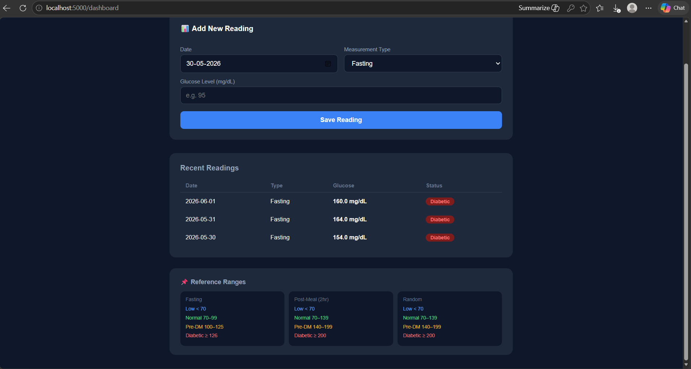
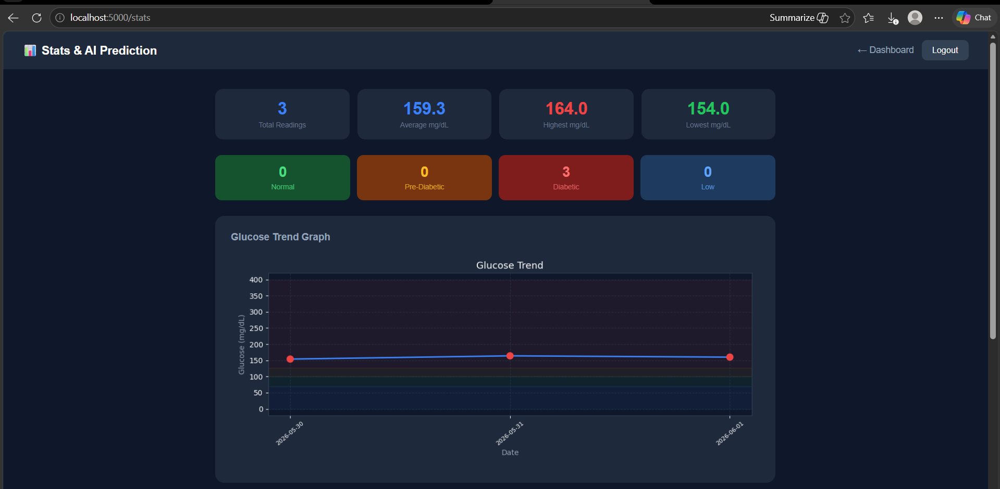
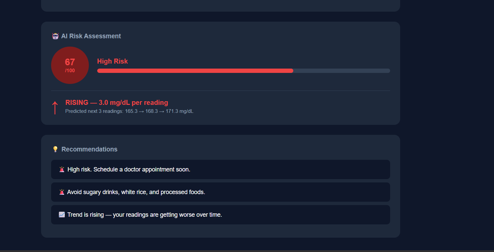
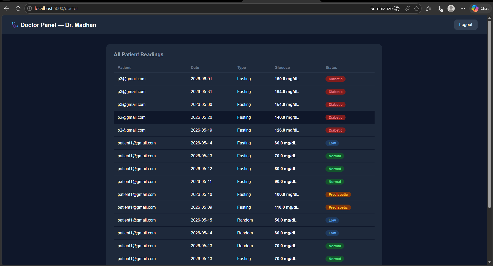
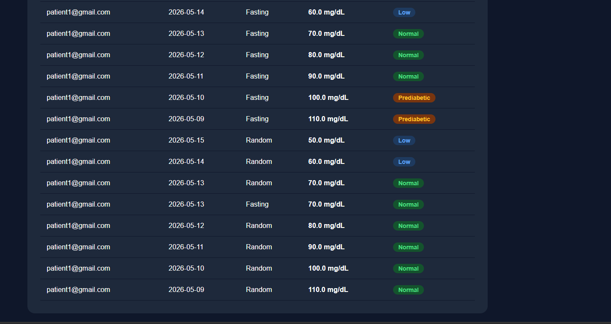
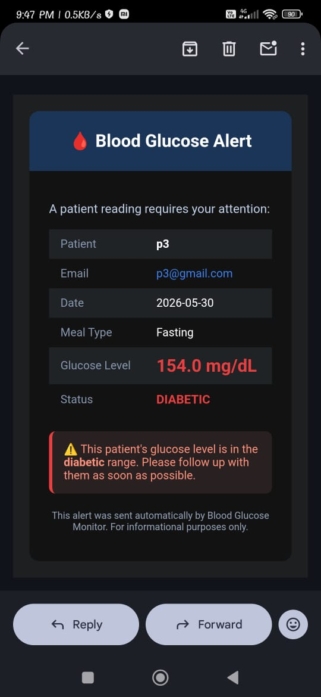
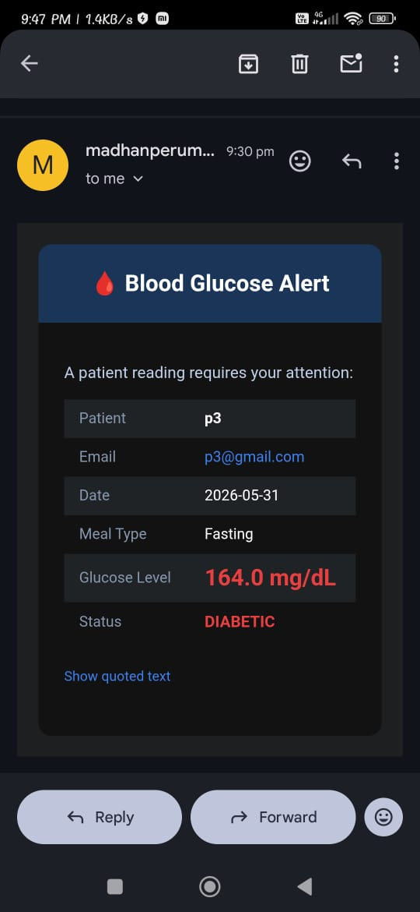

# 🩸 Blood Glucose Monitor

A clinical Blood Glucose Monitoring Web Application built with **Flask and Python**. Designed for patients and doctors to track, analyze, and manage blood glucose levels with AI-powered predictions, ML diabetes prediction, and automated email alerts.

---

## 🌐 Live Demo
👉 https://blood-glucose-monitor-nn39.onrender.com

---

## 📸 Screenshots

### Login Page

 

### Patient Dashboard

 

### Stats & AI Prediction

 

### Doctor Panel

 

### Email Alert

 

---

## ✨ Features

### 👤 Patient
- Secure login and registration
- Log glucose readings with date and meal type (Fasting / Post-Meal / Random)
- Automatic medical classification — Normal, Pre-Diabetic, Diabetic, Low
- View reading history with color coded status badges
- Interactive glucose trend graph
- AI risk score (0–100) with trend prediction
- Predicted next 3 glucose readings using Linear Regression
- Personalized health recommendations
- BMI calculator with health category
- PDF health report generation
- **ML Diabetes Prediction** — enter health data and get instant AI prediction

### 🩺 Doctor
- Separate doctor login
- View all patient readings in one table
- Automatic email alert when a patient's reading is dangerous
- Filter readings by status

---

## 🤖 AI & ML Features

### 1. Glucose Trend Prediction (Linear Regression)
- Calculates **Risk Score (0–100)** based on reading history
- Predicts **trend direction** — Rising, Stable, Improving
- Predicts **next 3 glucose readings**
- Gives personalized recommendations

### 2. Diabetes Prediction Model (Random Forest) — Level 4
Trained on the **Pima Indians Diabetes Dataset** (768 real patients):

| Feature | Importance |
|---|---|
| Glucose | 28.2% |
| BMI | 16.6% |
| Age | 13.8% |
| Diabetes Pedigree | 11.4% |
| Insulin | 8.2% |
| Blood Pressure | 8.2% |
| Skin Thickness | 7.0% |
| Pregnancies | 6.5% |

- **Algorithm:** Random Forest Classifier (100 trees)
- **Accuracy:** 77.27%
- **Output:** Diabetic / Not Diabetic with probability score
- **Risk Factor Analysis:** Color coded breakdown of each health parameter

---

## 📊 Medical Reference Ranges (mg/dL)

| Type | Low | Normal | Pre-Diabetic | Diabetic |
|---|---|---|---|---|
| Fasting | < 70 | 70 – 99 | 100 – 125 | ≥ 126 |
| Post-Meal (2hr) | < 70 | 70 – 139 | 140 – 199 | ≥ 200 |
| Random | < 70 | 70 – 139 | 140 – 199 | ≥ 200 |

---

## 🛠️ Tech Stack

| Layer | Technology |
|---|---|
| Backend | Python, Flask |
| Frontend | HTML, CSS |
| AI / ML | scikit-learn, NumPy, Pandas |
| ML Model | Random Forest Classifier |
| Graph | Matplotlib |
| PDF Generation | ReportLab |
| Data Storage | JSON |
| Email Alerts | smtplib, Gmail SMTP |
| Security | python-dotenv |
| Deployment | Render |
| Version Control | Git, GitHub |

---

## 🚀 Installation & Setup

### 1. Clone the repository
```bash
git clone https://github.com/madhan-healthtech/blood-glucose-monitor.git
cd blood-glucose-monitor
```

### 2. Install dependencies
```bash
pip install -r requirements.txt
```

### 3. Configure email alerts

Create a `.env` file in the project folder:
```
SECRET_KEY=your_secret_key
EMAIL_SENDER=your_gmail@gmail.com
EMAIL_PASSWORD=your_app_password
DOCTOR_EMAIL=doctor_email@gmail.com
```

> To get an App Password: Google Account → Security → 2-Step Verification → App Passwords

### 4. Run the app
```bash
python app.py
```

### 5. Open in browser
```
http://localhost:5000
```

---

## 👥 Default Accounts

| Role | Email | Password |
|---|---|---|
| Doctor | doctor@health.com | doctor123 |
| Patient | Register via app | Your choice |

---

## 📁 Project Structure

```
blood-glucose-monitor/
│
├── app.py                  ← Main Flask application
├── requirements.txt        ← Python dependencies
├── Procfile                ← Render deployment config
├── .env                    ← Secret credentials (not on GitHub)
├── README.md               ← Project documentation
│
├── model.pkl               ← Trained Random Forest model
├── scaler.pkl              ← Feature scaler
├── features.pkl            ← Feature names
│
├── m1_model/               ← ML training files
│   ├── diabetes.csv        ← Pima Indians dataset
│   └── train_model.py      ← Model training script
│
├── screenshots/            ← App screenshots
│
└── templates/
    ├── login.html          ← Login page
    ├── register.html       ← Register page
    ├── dashboard.html      ← Patient dashboard
    ├── stats.html          ← Stats, graph & AI prediction
    ├── predict.html        ← ML diabetes prediction
    └── doctor.html         ← Doctor panel
```

---

## 📈 Project Levels

| Level | Feature | Status |
|---|---|---|
| 1 | Desktop app with login, logging, graph, BMI | ✅ Complete |
| 2 | AI risk score and trend prediction | ✅ Complete |
| 3A | PDF health report generator | ✅ Complete |
| 3B | Flask web application | ✅ Complete |
| 3C | Email alerts for doctors | ✅ Complete |
| 4 | ML diabetes prediction — Random Forest | ✅ Complete |
| 5 | Database upgrade — SQLite | 🔜 Coming soon |
| 6 | Mobile responsive UI | 🔜 Coming soon |
| 7 | IoT sensor integration | 🔜 Coming soon |

---

## 🎓 About

Built by a **Madhan Kumar P 2nd year Biomedical Engineering ** as a practical project combining:
- Biomedical domain knowledge (glucose ranges, BMI, risk assessment)
- Python programming and web development
- AI and Machine Learning in healthcare
- Real world clinical application design
- Live deployment on cloud

**Domain:** Biomedical + Python + AI in Healthcare

---

## ⚠️ Disclaimer

This application is for **educational and informational purposes only**. It does not replace professional medical advice, diagnosis, or treatment. Always consult a qualified healthcare provider for medical decisions.

---

## 📄 License

This project is open source and available under the [MIT License](LICENSE).

---

⭐ If you found this project useful, please give it a star on GitHub!
